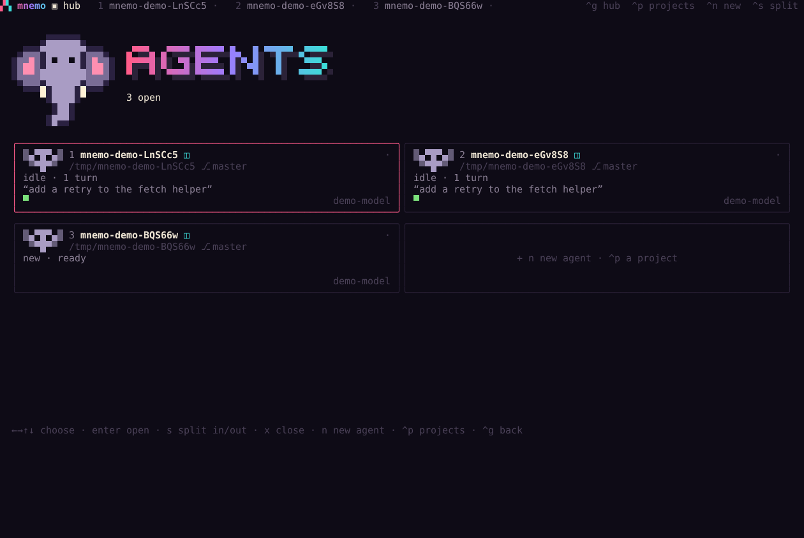

<p align="center"></p>

# Mnemo

[](https://github.com/AtmanMishra/mnemo/actions/workflows/ci.yml)
[](LICENSE)

**A terminal coding agent with a memory that learns your projects.** Several
agents in one window, a pixel interface, and your choice of model. Open source,
pre-alpha.



After each run Mnemo writes down what it learned about the project and about
you, recalls it in the next session, keeps the fix when something failed, and
writes skills for itself. The bet: a small, cheap model with accumulated memory
goes further than the same model without it.

## Install

macOS and Linux:

```bash
curl -fsSL https://github.com/AtmanMishra/mnemo/releases/latest/download/install.sh | sh
```

Windows (PowerShell):

```powershell
irm https://github.com/AtmanMishra/mnemo/releases/latest/download/install.ps1 | iex
```

No Bun, Node or Rust is needed: the installer downloads one archive holding
`mnemo` and its memory sidecar `memsrv`, checks its SHA-256, and puts both in
`~/.mnemo/bin`. Run it again to upgrade; add `--uninstall` (after `sh -s --`) to
remove it. Your memory and settings are never touched. Read the script first if
you like: [`app/scripts/get.sh`](app/scripts/get.sh).

Then:

```bash
mnemo doctor     # what it found: model, memory, python
mnemo --demo     # a scripted session in a scratch project; needs no API key
mnemo            # start in this folder
```

On first run, `/login` adds a provider key and `/model` picks a model. Mnemo also
uses credentials it finds in your environment (`ANTHROPIC_API_KEY`,
`OPENAI_API_KEY`, `OPENCODE_API_KEY`, `AWS_*` and others): see
[SECURITY.md](SECURITY.md).

<details><summary>From source</summary>

Needs [Bun](https://bun.sh) 1.4+ and a Rust toolchain.

```bash
git clone https://github.com/AtmanMishra/mnemo && cd mnemo
bun install
(cd memory-layer && cargo build --release --bin memsrv)
cd app && bun bin/mnemo.ts --demo
```

`app/scripts/install.sh` builds the binary and installs it from this checkout.
</details>

## What it does

- **Remembers.** Facts, conventions, pitfalls with their fixes, open threads and
  skills, stored locally. `/memory` shows them, `/forget` retires one, and the
  memory map (`m` in the memory pane) draws them.
- **Memory for other agents.** `mnemo memory setup claude-code` prints the hooks
  and MCP entry that give Claude Code (or Codex) the same memory; `mnemo memory
  ingest` learns from Claude Code sessions you already have.
- **Many agents, one window.** `ctrl+g` the hub, `ctrl+s` split view (up to
  four), `ctrl+p` switch project, `ctrl+n` another agent on this project.
- **Checks its work.** A run that changed code and ran nothing is sent back to
  run the project's checks. `--escalate provider/id` finishes a run on a stronger
  model after two failed checks; `mnemo -p "<task>" --best-of 3 --check "npm
  test"` races three attempts in separate worktrees and applies the smallest
  change that passes (`/bestof` does the same from the interface).
- **A pixel interface** with Mne the elephant, three themes (`/theme`) and a
  sidebar for files, memory, sessions, skills and logs. The spec is
  [DESIGN.md](DESIGN.md).

## Does the memory help?

Measured on a small model (DeepSeek v4.1 Flash), the same loop with memory on
and off. Small samples; the write-ups say what went wrong along the way.

| Test | No memory | Memory |
|---|---|---|
| six tasks in one repo, with rules the code does not reveal (3 runs) | 87% | 100% |
| two repos whose rules conflict (2 runs) | 82% | 99% |
| Terminal-Bench subset: 10 easy/medium tasks, one attempt each | 10/10 | 10/10 |

The last row is the honest one: unrelated one-off tasks give memory nothing to
remember. It is a subset run on our own machine, not comparable to the public
leaderboard. Details, and a comparison with a Hermes-style memory:
[research/](research/), [research/hermes-comparison.md](research/hermes-comparison.md),
[research/terminal-bench-2026-10-08.md](research/terminal-bench-2026-10-08.md).

## Before you run it

Mnemo reads your files, edits them and runs commands as you. It asks before
every edit and command by default (`/mode`); `--yolo` and headless `-p` ask for
nothing, so use those in a container or a throwaway checkout. The gate filters
what runs; it is not a sandbox. Your prompts and the files the model reads go to
the provider you chose; nothing else leaves your machine, and there is no
telemetry. Read [SECURITY.md](SECURITY.md), which also says how to report a
vulnerability.

## Repository

| Path | |
|---|---|
| `app/` | the program: Ink interface, agent loop on the [pi](https://github.com/earendil-works/pi) SDK, extensions, evals |
| `packages/memory/` | `@mnemo/memory`: the memory loop any agent can drive |
| `memory-layer/` | `memsrv`, the Rust memory sidecar |
| `site/` | the project page and installers (GitHub Pages) |
| `docs/` | [ROADMAP](docs/ROADMAP.md), [RELEASING](docs/RELEASING.md), [the previous stack](docs/LEGACY.md) |
| `research/` | the evals and the design papers |
| `tui-go/`, `agent/`, `harness-engine/` | the previous stack; still run, no new features |

Contributing: [CONTRIBUTING.md](CONTRIBUTING.md). Maintainers cutting a release:
[docs/RELEASING.md](docs/RELEASING.md).

## Status

Pre-alpha. It works, it has tests, and it has rough edges; file what you find in
[the issue tracker](https://github.com/AtmanMishra/mnemo/issues). What is left,
in order, is in [docs/ROADMAP.md](docs/ROADMAP.md).

## License

[Apache-2.0](LICENSE). Third-party notices: [NOTICE](NOTICE).
