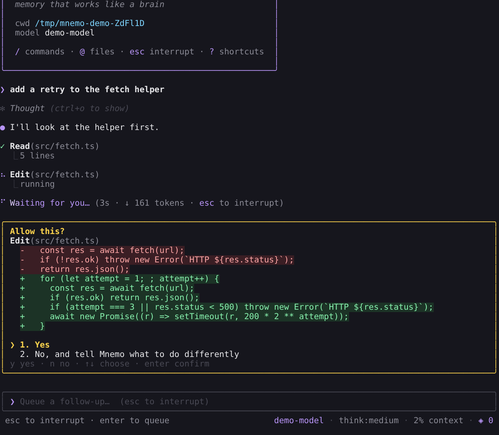
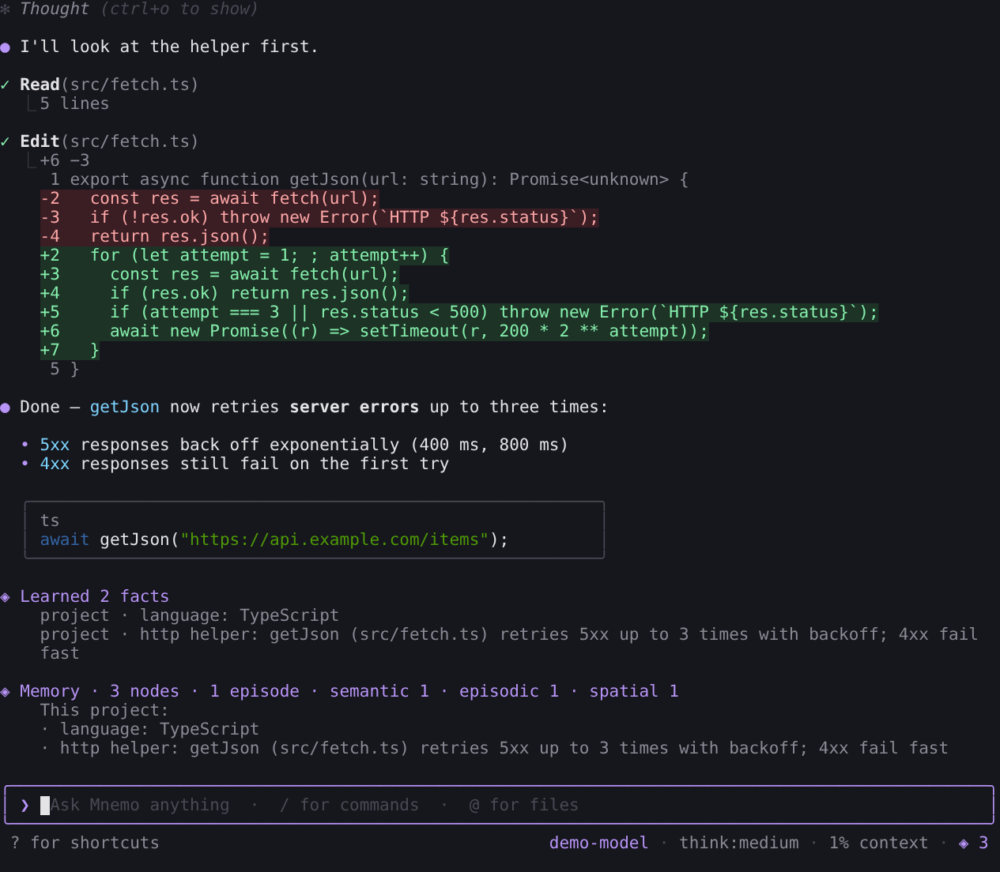

# Mnemo

A terminal-native agentic coding and harness assistant whose memory works like a brain. Small and local models can reach frontier-level performance through accumulated memory, experience, and hierarchical collaboration rather than raw model scale. Proven live: 3/3 task success WITH memory versus 0/3 WITHOUT, on a free model (ox-alpha-free via OpenCode).

## Quickstart

> **Status: working prototype (Bun rebuild).** `app/` is the new Mnemo: an Ink
> interface on the [pi](https://github.com/earendil-works/pi) agent SDK, the Rust
> memory sidecar, and a Python kernel. It remembers across sessions — after each
> run it writes what it learned about the project and about you, injects that into
> every later turn, steers its memory when something fails, and can write skills
> for itself. What is left: [`docs/ROADMAP.md`](docs/ROADMAP.md). Interface spec:
> [`DESIGN.md`](DESIGN.md).
>
> ```bash
> # from a release (once v0.1 is tagged) — nothing else needed
> curl -fsSL https://github.com/AtmanMishra/self-evolving-agent/releases/latest/download/install.sh | sh
> irm https://github.com/AtmanMishra/self-evolving-agent/releases/latest/download/install.ps1 | iex   # Windows
>
> # from this checkout (needs bun and cargo)
> app/scripts/install.sh
>
> mnemo doctor                # what is installed and reachable
> mnemo                       # the launch, a first-run introduction, then the workspace
> mnemo --demo                # a scripted session in a scratch project — no key needed
> mnemo memory setup claude-code   # attach the same memory to Claude Code (or: codex)
> ```
>
> Or without installing: `cd app && bun install && bun bin/mnemo.ts`.
> `app/scripts/test-install.sh` installs a locally built release in a clean
> container and runs a turn — the first-run check.
>
> 
> 
>
> The instructions below build the previous stack (Go interface + Node agent).

**Pre-alpha.** Grab the `mnemo` binary for your platform from
[Releases](https://github.com/AtmanMishra/self-evolving-agent/releases) —
linux/darwin/windows, amd64/arm64 — then build the two pieces it drives. Node
>= 22.18 is required (the first version that runs `.ts` files with no flag —
"no build step" is only true from there); Rust is
needed only for the memory sidecar, and Go only if you would rather build the
interface than download it.

```bash
git clone https://github.com/AtmanMishra/self-evolving-agent
cd self-evolving-agent

./scripts/install.sh              # macOS / Linux
.\scripts\install.ps1             # Windows (PowerShell)

Both are interactive onboarding, not a script that clones and hopes. They check
your toolchain and show you a table of what they found, let you choose which
components to install (the interface, the agent runtime, the memory sidecar, the
harness engine), tell you exactly what they are about to run and ask, then
install — and then **verify by rendering a frame**: `mnemo --version` and an
offline `--dump`, reporting a failure if either does not exit 0.

They are built on [gum](https://github.com/charmbracelet/gum) and bootstrap it
themselves (`go install`, then a release download, then plain prompts), so gum is
a nicer way to ask and never a requirement. `--yes` / `-Yes` takes the defaults
with no questions, `--dry-run` / `-DryRun` prints every command without running
one — which is also what happens automatically when there is no terminal, so
nothing ever sits waiting for a keypress it will not get. Running either twice is
safe. They create `~/.mnemo` if it is missing and never touch what is inside it.

To install the pieces by hand instead:
cd memory-layer && cargo build --bin memsrv   # the Memory pane talks to this
cd ../agent && npm install                     # the agent the TUI drives
cd ../tui-go && go build -o mnemo ./cmd/mnemo  # or drop the release binary here
```

The installers check your toolchain before touching anything, say what they are
doing, and take `--dry-run` (`-DryRun` on Windows) to say it without doing it.

`mnemo --version` says which build you are running. Bugs and rough edges belong
in [the issue tracker](https://github.com/AtmanMishra/self-evolving-agent/issues)
— the known gaps are filed there rather than described as future work.

On first launch, `mnemo` runs a colourful pixel-themed onboarding wizard inside the TUI: pick a provider, paste an API key, and pick a default model. Credentials are saved to `~/.mnemo/auth.json` (chmod 600), never in the repo. That wizard lives in the Go TUI itself (tui-go/). One unified surface — the transcript IS the application; everything else (palette, sessions, memory, logs, explorer) floats as an overlay dismissed with esc.

> The old Rust/ratatui TUI was archived on branch `archive/tui-rust` and is no longer part of the main system. It was fully superseded by tui-go/.

## Commands

| Command | Purpose |
|---------|---------|
| `mnemo` | the TUI — one surface, transcript-first (build: `cd tui-go && go build -o mnemo ./cmd/mnemo`) |
| `mnemo "<prompt>"` | One-shot query; how sub-agents run |
| `mnemo auth [status\|logout <provider>]` | Credential management (status checks provider/key; logout removes a provider) |
| `mnemo consolidate` | Distil recurring episodes into semantic lessons |
| `mnemo traces [session-id]` | Span trees from ~/.mnemo/logs; `--json` for raw output |
| `mnemo init [--dry-run\|--yes]` | Propose the project-memory file pi loads — `AGENTS.md`, or the one already there |
| `mnemo pr [--base <ref>] [--dry-run] [--review]` | Open a pull request for the current branch, titled and described from its commits |
| `mnemo --list-models` | Show available models per provider |
| `mnemo --list-sessions` | List past sessions |

Inside a running session, use `/login` and `/model` to change provider or model.
Any other `/name` the interface does not implement itself is sent to the agent
verbatim — which is how the agent's own commands (`/hook`, `/schedule`,
`/trigger`, `/now`), a prompt template, or `/skill:<name>` is reached.

`mnemo init` reads the repository — manifests, scripts, top-level layout, CI
workflows, existing docs — and proposes the instructions file pi loads at
startup for this project. Creating one writes it; changing one shows the diff
and asks, and an unanswered question is a refusal (`--yes` is you answering it
in advance). The generated part sits between `mnemo:init` markers, so a second
run refreshes it in place and never reorders a line you wrote; a `write_file`
deny rule covers it like any other write.

`mnemo pr` derives its title and body from the commits on the branch — the
branch's first commit titles it, and the body is the log plus the real
`git diff --stat`; no model writes a word of it. It refuses rather than guesses:
on the base branch, with nothing committed, without an authenticated `gh`, or
when the remote has commits the branch does not have. It never force-pushes.
`--review` posts a summary of the diff behind its own flag — a summary, not a
verdict, because nothing reviewed anything.

### Your own slash commands: prompt templates

pi's prompt templates are Markdown files that become `/name` — no code, no
registration, nothing to add to this repository:

| Where | Scope |
|-------|-------|
| `~/.pi/agent/prompts/<name>.md` | global — every project |
| `.pi/prompts/<name>.md` | this project, once the project is trusted — Mnemo asks once, records the answer in `~/.mnemo/trust.json` and says so in the transcript |

`review.md` is `/review`. Frontmatter takes an optional `description` and
`argument-hint`; the body is the prompt, with pi's argument syntax (`$1`, `$@` or
`$ARGUMENTS`, `${1:-default}`). pi expands the template before the prompt is
sent, so `/review main` reaches the model as your review prompt with `main` in
it — Mnemo does not reinterpret it.

They are listed next to skills and the agent's own commands in the palette
(`^k`) and the slash menu: the interface asks the agent for its command list and
shows what comes back, so a template appears with its path and `prompt · user`
provenance the next time the agent starts. A template can also be typed by name
without ever opening the palette.

**Which to write**: a prompt template for a repeatable *instruction* — something
you say — and a skill for a repeatable *procedure* — steps, references, maybe
scripts. A skill is discovered by its description, so the agent can pick it
itself; a template is only ever chosen by you, by name. pi's own docs cover the
frontmatter and argument syntax in full.


## Configuration

Files under `~/.mnemo/`:

| File | Purpose |
|------|---------|
| `auth.json` | Provider credentials (chmod 600); never committed |
| `permissions.json` | Tool allow/deny rules with glob patterns (enforced everywhere, with or without a TTY). The `ask` tier is asked in the interface: the TUI spawns the agent with `MNEMO_APPROVAL_MODE=interactive` and answers pi's dialog. A run with no UI at all fails open (automation keeps working) — except a delegated sub-agent child, which fails closed |
| `mcp.json` | MCP servers as registered tools (named `mcp__<server>__<tool>`) |
| `tools.json` | Which tools the agent is offered: `{"disabled": ["web_search"]}`. A `<project>/.mnemo/tools.json` is unioned with it and can only restrict, never re-enable. Takes effect on the next run — the tool list is part of the model's cached prompt prefix, not a mid-session switch |
| `logs/<date>.jsonl` | Structured trace spans; secrets redacted before write |

Environment variables:

- `MNEMO_HOME` — where Mnemo keeps its per-user state, `~/.mnemo` by default: `tools.json`, `skill-history/`, and the memory sidecar and its journal
- `MNEMO_APPROVAL_MODE=interactive` — prompt before mutating tools
- `MNEMO_PLAN_MODE=1` — read-only phase
- `MNEMO_LOG_LEVEL` — debug, info, warn, error, or off
- `MNEMO_SUBAGENT_MAX_DEPTH` — how deep `spawn_subagent` may nest (default 3; 0 forbids delegation). Children inherit it, so set it on the top-level agent
- `BRAVE_API_KEY` or `TAVILY_API_KEY` — optional; enables web_search tool
- `PI_CODING_AGENT_SESSION_DIR` — where pi stores sessions; the sessions browser reads it, and `sessionDir` in pi's `settings.json` otherwise (see below)

### Credentials: what actually works today

Mnemo runs on a credential of its own **or** on one pi already holds; it no
longer refuses to start without a key of its own. `mnemo auth status` says
which of these your machine has.

| Credential | Where it lives | Set it up with |
|---|---|---|
| API key for `anthropic`, `openai`, `openrouter`, `opencode`, `opencode-go` | `~/.mnemo/auth.json` (chmod 600), or the matching environment variable (`ANTHROPIC_API_KEY`, `OPENAI_API_KEY`, `OPENROUTER_API_KEY`, `OPENCODE_API_KEY`) | the wizard on `mnemo`'s first launch, `/login` in the TUI, or export the variable |
| A pi subscription — Claude Pro/Max, ChatGPT Plus/Pro, GitHub Copilot, xAI, OpenRouter, Radius | pi's own `~/.pi/agent/auth.json` | pi's CLI, which ships as a dependency: `./agent/node_modules/.bin/pi` (`agent\node_modules\.bin\pi.cmd` on Windows), then `/login` inside it. Then `MNEMO_PROVIDER=<id>` — e.g. `anthropic`, `openai-codex`, `github-copilot`, `xai` |
| A local model server — a llama.cpp router | `LLAMA_BASE_URL` (+ optional `LLAMA_API_KEY`), or pi's `auth.json` | start the router, then `MNEMO_PROVIDER=llama.cpp`; `MNEMO_MODEL` picks which loaded model |

Mnemo passes `MNEMO_PROVIDER` straight through to pi, so any provider id pi
knows works — including ones Mnemo cannot key itself. `MNEMO_MODEL` names the
model; without it, Mnemo's stored default wins, then pi's own `defaultModel`
from `~/.pi/agent/settings.json`. Anthropic's own rules for Claude Pro/Max in a
third-party harness are in [pi's provider docs](https://github.com/earendil-works/pi-mono).

### Where sessions live

The sessions browser (`^s`) reads the same directory pi writes to, resolved in
pi's order: `PI_CODING_AGENT_SESSION_DIR`, then `sessionDir` in pi's global
`settings.json` (under `PI_CODING_AGENT_DIR` or `~/.pi/agent`), then
`~/.pi/agent/sessions`. When one is configured, the agent Mnemo spawns is given
the same `--session-dir`, so what you browse is what the agent writes.

## What's in here

- **memory-layer/** (Rust) — Graph memory engine: nodes (facts/state/log/context), typed edges, steering, HNSW search. Binaries: memcli (REPL), memsrv (JSON-RPC sidecar), memeval (retrieval benchmark), mempolicy (learned steering evaluation).
- **harness-engine/** (TypeScript, zero deps) — Dynamic tool-plugin system: createHarness() writes bundles that agents build for themselves at runtime.
- **agent/** (TypeScript on Node >=22.6) — The mnemo CLI; thin shim over pi with Mnemo's tools and extensions injected.
- **app/** (Bun, TypeScript, Ink) — the rebuild: an Ink interface on pi's in-process SDK, plus the policy, memory and kernel clients being moved over from `agent/`. See the roadmap.
- **tui-go/** (Go, Bubble Tea v2) — *legacy.* The terminal interface that works today: one surface, transcript-first, overlays for palette/sessions/memory/logs/explorer, hooks + schedules digests. Retired once `app/` reaches parity.

## Development

All four codebases must be green:

```bash
cd agent && npm test && npx tsc --noEmit
cd ../memory-layer && cargo test
cd ../tui-go && go test ./... && go vet ./...
cd ../harness-engine && npm test
```

Start with **`docs/MNEMO.md`** — what Mnemo is and how to run it — and go to **`docs/MNEMO-INTERNALS.md`** when you are changing it: memory model, kernel, protocols, extension points. **`DESIGN.md`** owns how it looks (palette, glyphs, mascot, keys). **`AGENTS.md`** is the contract for agents working in this repo. **`plan.md`** tracks the work, **`STATUS.md`** records outcomes with evidence, and **`research/`** holds the current design papers. Superseded architecture docs, reports and diagrams are in **`docs/archive/`**.

## License

MIT
