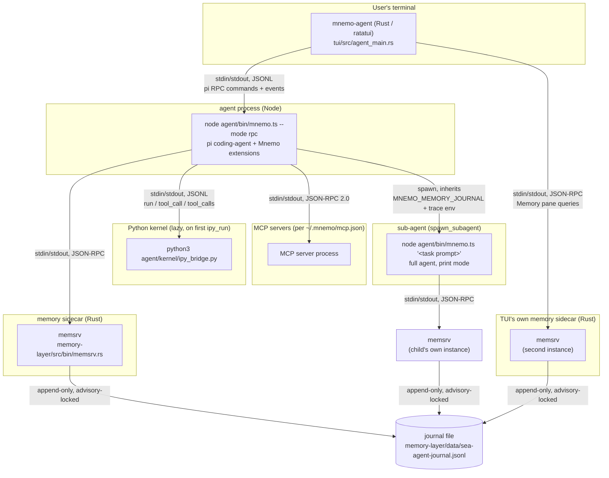

# Mnemo — Architecture

> **Note (archive).** The Rust TUI (`tui/`, ratatui) was archived on branch
> `archive/tui-rust` and is no longer in the main system. The presentation
> layer is now `tui-go/` (Go, Bubble Tea v2) — one surface, transcript-first.
> `mnemo-agent` in this document refers to the old Rust binary; the Go
> equivalent is `tui-go/cmd/mnemo`.

> **On citations.** This document names files, not line numbers. The repo is
> under active development and spans go stale within hours — an earlier draft
> of these docs cited `tui/src/agent_main.rs` lines that had already moved by
> the time it was written. For an exact span, ask the code:
> `graft ask "<question>" --source`, or `graft skeleton <file>`.

Mnemo is a terminal-native coding agent whose long-term memory is modeled as a
small brain rather than a flat vector store: nodes and edges organized into
six areas (episodic, semantic, procedural, spatial, salience, executive),
mutated through an append-only journal, and consulted automatically on every
turn. The premise (see `README.md`) is that a small or free model plus
accumulated memory can outperform the same model without it.

This document is the entry point into `docs/`. It describes the four
codebases, how they are split, what process boundaries exist between them,
and points to the deeper documents:

- `docs/DATAFLOW.md` — one user turn traced through every process and file.
- `docs/KERNEL.md` — the Python kernel and programmatic/parallel tool calling.
- `docs/PI-INTEGRATION.md` — how Mnemo is built as extensions over the `pi`
  coding-agent framework.
- `docs/MEMORY.md` — the memory layer's graph model, brain areas, journal,
  search/routing, steering, consolidation, and auto-recall.

There are also two earlier design documents at `docs/system-design.md` and
`docs/memory-layer-design.md`, which record the original spec this
implementation grew from; this set of documents describes the system as it
exists in the code today, with exact file:line references.

## The four codebases

Mnemo is a monorepo of four independently-buildable pieces. Each is a
separate language, a separate process at runtime, and a separate concern:

| Codebase | Language | Role |
|---|---|---|
| `agent/` | TypeScript (Node ≥22.18, native TS stripping, no build step) | The agent process. Wraps the `pi` coding-agent framework, registers Mnemo's tools, and hosts the memory-layer and Python-kernel clients. |
| `memory-layer/` | Rust | The brain. An in-process graph store plus `memsrv`, the JSON-RPC sidecar that is the memory system's single integration surface. |
| `tui/` | Rust (ratatui) | `mnemo-agent`, the terminal UI. Drives the agent process over pi's RPC protocol and runs its own memsrv client for the Memory pane. |
| `harness-engine/` | TypeScript, zero runtime deps | Loads and validates dynamically generated tool-plugin bundles ("harnesses") that the agent can create for itself via the `create_harness` tool. |

None of these codebases import each other's source directly. They talk over
process boundaries — spawned subprocesses speaking line-delimited JSON on
stdio — which is the architectural theme of this whole system (see below).

### `agent/` — the agent process

Entry point: `agent/bin/mnemo.ts`. It is a thin CLI shim: subcommands
(`auth status|logout`, `traces`, `consolidate`, `--list-sessions`) are
handled locally without needing a model provider; everything else forwards to
pi's own `main(argv, { extensionFactories })` (`agent/bin/mnemo.ts,314`).
Mnemo supplies four `InlineExtension`s as `factories()`
(`agent/bin/mnemo.ts`):

- `sea-tools-inline` (`agent/extensions/sea-tools-inline.ts`) — registers all
  14 Mnemo tools (11 core tools from `agent/src/tools/index.ts`, plus 3
  memory tools) onto pi, and wires the same tools into the Python kernel's
  `tools.<name>()` dispatcher.
- `sea-memory` (hooks half of `agent/extensions/memory-layer.ts`) — session
  lifecycle logging and the auto-recall directive; the memory *tools* are
  registered separately by `sea-tools-inline` because pi rejects duplicate
  tool names across extensions.
- `approval-gate` (`agent/extensions/approval-gate.ts`) — the y/n gate on
  `bash_exec`/`write_file`/`apply_edit`, plus the permission-rule engine that
  applies to every tool.
- `tracing` (`agent/extensions/tracing.ts`) — turns pi's session events into
  the nested spans that `mnemo traces` renders.

Full tool inventory: `bash_exec`, `read_file`, `write_file`, `apply_edit`,
`glob_list`, `ipy_run`, `list_skills`, `load_skill`, `create_skill`,
`spawn_subagent`, `create_harness`, `web_fetch`, `web_search`, `read_image`
(`agent/src/tools/index.ts`), plus `memory_search`,
`memory_write_fact`, `memory_steer` (`agent/extensions/memory-layer.ts`).
MCP servers configured in `~/.mnemo/mcp.json` are discovered before `main()`
runs and their tools are added under `mcp__<server>__<tool>`
(`agent/bin/mnemo.ts`, `agent/src/mcp.ts`).

### `memory-layer/` — the brain

`memory-layer/src/model.rs` defines the data: `Node`/`Edge`/`Fact` and the
`Op` journal enum that is the only way state changes
(`memory-layer/src/model.rs`). `memory-layer/src/store.rs` is the
in-memory graph (`apply()` replays one `Op`;
`memory-layer/src/store.rs`). `memory-layer/src/search.rs`,
`steering.rs`, and `consolidate.rs` are pure planners: given the store, they
compute a plan of `Op`s to journal, never mutating anything themselves — see
`docs/MEMORY.md` for how each works. `memory-layer/src/bin/memsrv.rs` is the
sidecar binary every other process talks to; it owns the journal file, the
embedder, and the logical clock, and exposes `ping`, `create_node`,
`episode`, `fact`, `link`, `search`, `steer`, `consolidate`, `commit_log`,
`good`, `set_area`, `state`, and `dump` as JSON-RPC methods
(`memory-layer/src/bin/memsrv.rs`). `memcli`, `memeval`, and
`mempolicy` in `memory-layer/src/bin/` are auxiliary CLIs for scripting and
evaluating the memory layer directly against a journal file, without an
agent process.

### `tui/` — the terminal UI

`tui/src/agent_main.rs` is the `mnemo-agent` binary: it owns the ratatui
event loop, six panes (Chat, Sessions, Memory, Agents, Skills, Logs —
`tui/src/agent_main.rs`), the onboarding wizard, and two subprocess
clients — `RpcSession` (`tui/src/rpc.rs`) for the agent process and
`MemSession` (`tui/src/memclient.rs`) for its own, independent memsrv
connection used to populate the Memory pane. The TUI never talks to memsrv
*through* the agent process; it spawns its own sidecar against the same
journal file, so two readers of one file are always consistent because the
journal itself is the source of truth and every writer takes an advisory
file lock before appending (`memory-layer/src/persist.rs`).

### `harness-engine/` — dynamic tool plugins

Zero-runtime-dependency loader/validator for "harnesses": tool-plugin
bundles the agent can write for itself via `create_harness`
(`agent/src/tools/harness.ts`) and that `harness-engine/src/bundle.ts` and
`registry.ts` load and register at runtime. This is the procedural-memory
counterpart to the graph: a `Harness` node in memory
(`memory-layer/src/model.rs`) can point at generated code the agent wrote
for itself, routed into `Area::Procedural`.

## The recurring pattern: line-delimited JSON over stdio

Every process boundary in Mnemo speaks the same shape of protocol: one JSON
object per line, written to a pipe, read by a line-buffered reader on the
other end. This is deliberate and repeats four times:

1. **pi RPC** (`agent/bin/mnemo.ts --mode rpc`, driven by `tui/src/rpc.rs`) —
   commands (`prompt`, `steer`, `abort`, …) go down stdin, events
   (`agent_start`, `message_update`, `tool_execution_end`, `turn_end`, …)
   stream up stdout. See pi's own protocol doc,
   `agent/node_modules/@earendil-works/pi-coding-agent/docs/rpc.md`.
2. **memsrv** (`memory-layer/src/bin/memsrv.rs`, spoken by
   `agent/extensions/memory-layer.ts`'s `MemClient` and by
   `tui/src/memclient.rs`'s `MemSession`) — `{"id":1,"method":"search",...}`
   in, `{"id":1,"ok":true,"result":...}` out.
3. **the Python kernel bridge** (`agent/kernel/ipy_bridge.py`, spoken by
   `agent/src/tools/ipy_run.ts`'s `IPyKernel`) — `{"id":1,"op":"run","code":...}`
   down, results up, plus an *out-of-band* `tool_call`/`tool_calls` line that
   flows the other direction mid-execution (see `docs/KERNEL.md`).
4. **MCP** (`agent/src/mcp.ts`) — standard MCP stdio transport, which is
   itself line-delimited JSON-RPC 2.0; Mnemo speaks it directly rather than
   pulling in the MCP SDK, because the shape is identical to the other three
   (`agent/src/mcp.ts`).

The payoff of committing to one transport shape everywhere: no protocol
library is a hard dependency, every one of these clients is independently
testable against recorded lines with no live subprocess (see e.g.
`tui/src/rpc.rs`'s `parse_event` tests, `tui/src/rpc.rs`), and a
human debugging a stuck agent can `cat` the pipe. The cost is that each
client re-implements its own line-buffering and request/response
correlation — there are at least four near-identical "accumulate a buffer,
split on `\n`, `JSON.parse`, resolve a pending map by id" implementations in
this codebase (`agent/extensions/memory-layer.ts`,
`agent/src/tools/ipy_run.ts`, `agent/src/mcp.ts`,
`tui/src/rpc.rs`'s stdout reader thread). That duplication is a known,
accepted cost rather than an oversight — see the note in
`agent/kernel/ipy_bridge.py`'s module docstring about why the kernel
bridge in particular cannot share a generic implementation (the tool-call
protocol needs to read replies from the *same* stdin object the main loop is
blocked on).

## Process topology

Notes on this diagram:

- **The agent process is spawned fresh per TUI session** (or per one-shot
  `mnemo "<prompt>"` invocation) — `tui/src/rpc.rs` builds
  `node agent/bin/mnemo.ts --mode rpc --no-builtin-tools` and runs it with
  `current_dir(cwd)` set to the *project* directory, not the Mnemo repo,
  which is why pi's own session files land under the project the user is
  actually working in (`tui/src/rpc.rs`, tested at
  `tui/src/rpc.rs`).
- **memsrv is spawned lazily, on first request**, both by the agent
  (`agent/extensions/memory-layer.ts`, `start()`) and by the TUI
  (`tui/src/memclient.rs` follows the same one-process-per-`query`/one-long-
  lived-process pattern depending on caller). Every memsrv instance opens the
  *same* journal file by default
  (`memory-layer/data/sea-agent-journal.jsonl`, overridable with
  `MNEMO_MEMORY_JOURNAL`), so the graph is a shared bus across however many
  processes are touching it — safety comes from the journal's own advisory
  file lock (`memory-layer/src/persist.rs`), not from having one
  writer.
- **The Python kernel is spawned lazily on the first `ipy_run` call**
  (`agent/src/tools/ipy_run.ts`, `start()`) and stays alive for the
  rest of the agent process's life, so kernel state (variables, imports)
  persists across calls like a notebook (`agent/kernel/ipy_bridge.py`).
- **A sub-agent is a completely separate `mnemo.ts` process**, spawned via
  Node's `child_process.spawn` in `agent/src/tools/subagent.ts`. It
  gets its own memsrv (because `MNEMO_MEMORY_JOURNAL` is an environment
  variable naming a *file path*, not a live connection) but that file is the
  same shared journal, and trace environment variables are inherited so its
  spans nest under the parent's (`agent/src/tools/subagent.ts`,
  `agent/extensions/tracing.ts`). See `docs/KERNEL.md` for the full
  sub-agent sequence, including model override.
- **MCP servers** are discovered once at startup
  (`agent/bin/mnemo.ts`) and stay alive for the process lifetime; a
  server that fails to start is reported on stderr but never blocks the
  agent (`agent/src/mcp.ts`).

## Where state lives on disk

| Path | Owner | Contents |
|---|---|---|
| `~/.mnemo/auth.json` (mode 0600) | `agent/src/auth/store.ts` | Provider credentials, per-provider default model. |
| `~/.mnemo/permissions.json` | `agent/src/permissions.ts` | Ordered allow/ask/deny rules, first match wins. |
| `~/.mnemo/mcp.json` | `agent/src/mcp.ts` | Configured MCP servers. |
| `~/.mnemo/logs/<date>.jsonl` | `agent/src/trace.ts` | One JSON span per line, redacted before write; read back by `mnemo traces`. |
| `memory-layer/data/sea-agent-journal.jsonl` (default; `MNEMO_MEMORY_JOURNAL` overrides) | `memory-layer/src/persist.rs` | The memory graph's append-only op log — the only source of truth for memory state. |
| `~/.pi/agent/sessions/<encoded-cwd>/<timestamp>_<uuid>.jsonl` | pi (not Mnemo code) | Conversation session transcripts, one file per session, keyed by project working directory. |

The session-transcript store and the memory journal are deliberately
separate systems with different lifetimes: a pi session is one conversation
and is disposable (forkable, resumable, exportable to HTML); the memory
journal is cross-session and cross-project by design — it is the thing that
lets a fresh session on a fresh model start with what earlier sessions
learned.

## Where to go next

- Trace one keypress all the way through: `docs/DATAFLOW.md`.
- How `ipy_run` turns a loop of tool calls into one round trip:
  `docs/KERNEL.md`.
- What pi gives Mnemo for free, and where Mnemo's four `InlineExtension`s
  hook in: `docs/PI-INTEGRATION.md`.
- The graph model, brain areas, and how steering/consolidation reshape
  memory over time: `docs/MEMORY.md`.
