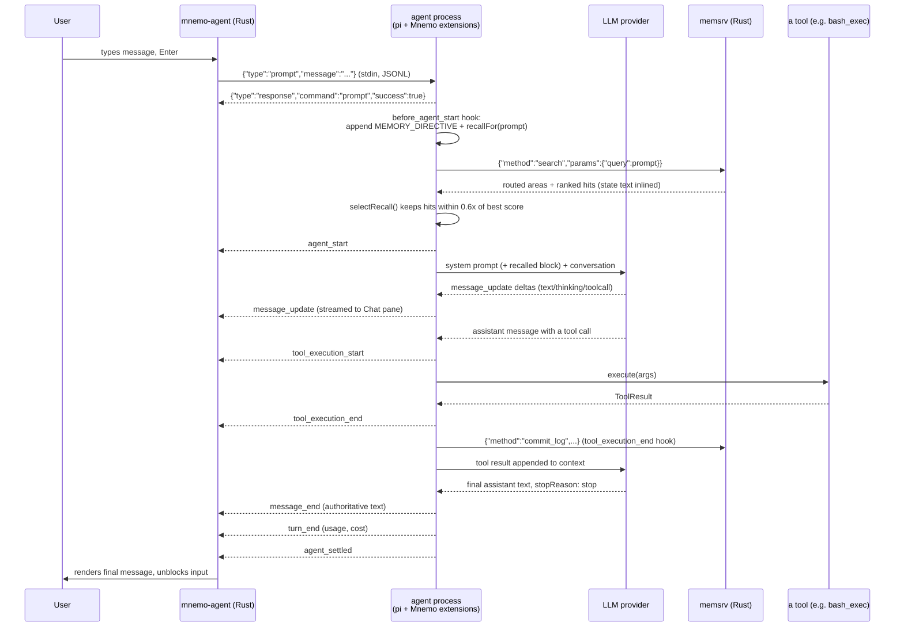
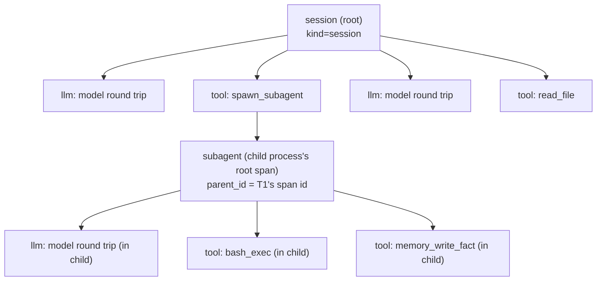

# Data Flow — One User Turn, End to End


> **On citations.** This document names files, not line numbers. The repo is
> under active development and spans go stale within hours — an earlier draft
> of these docs cited `tui/src/agent_main.rs` lines that had already moved by
> the time it was written. For an exact span, ask the code:
> `graft ask "<question>" --source`, or `graft skeleton <file>`.

This document traces exactly what happens, in what process, in which file,
when a user in `mnemo-agent` types a message and presses Enter. It assumes
the topology described in `docs/ARCHITECTURE.md`: TUI process, agent
process, memory sidecar, and (conditionally) a Python kernel and MCP
servers.

## The short version



The rest of this document expands each of these steps with the exact code
that runs.

## 1. Keystroke to RPC command

The TUI's main loop (`tui/src/agent_main.rs`) is a poll loop over
terminal events. Enter on a non-empty input, with a model configured and the
agent not already busy, calls `send_prompt`
(`tui/src/agent_main.rs`), which appends the line to the Chat pane
and calls `RpcSession::prompt`:

```rust
pub fn prompt(&mut self, message: &str) -> std::io::Result<()> {
    self.send(serde_json::json!({ "type": "prompt", "message": message }))
}
```
(`tui/src/rpc.rs`)

`send` assigns a fresh request id, serializes the command, and writes one
line to the child process's stdin (`tui/src/rpc.rs`). If the agent
is mid-stream when the user submits another line, `cockpit.busy` routes it
into `cockpit.queued` instead (`tui/src/agent_main.rs`) and it is
sent once the current turn settles — a queued message costs one whole turn,
by design (`tui/src/agent_main.rs`).

If the user is mid-run and explicitly *steers* (a distinct keybinding),
`RpcSession::steer` sends `{"type":"steer",...}` instead, which pi delivers
after the current tool-calling turn finishes but before the next model call
(`tui/src/rpc.rs`; protocol semantics documented in pi's
`docs/rpc.md`, "steer" command).

## 2. Inside the agent process: pi's command loop

The agent process is `node agent/bin/mnemo.ts --mode rpc`, which — once past
the CLI dispatch in `run()` (`agent/bin/mnemo.ts`) — calls pi's own
`main(args, { extensionFactories: factories() })`
(`agent/bin/mnemo.ts`). From here, everything about *reading* the RPC
command, queuing/streaming behavior, and writing back a `response` line is
pi's own `--mode rpc` implementation (see
`agent/node_modules/@earendil-works/pi-coding-agent/docs/rpc.md`). What
Mnemo controls is the four `InlineExtension`s registered in `factories()`
(`agent/bin/mnemo.ts`) and their hook callbacks, which pi invokes at
specific points in its own lifecycle (documented fully in pi's
`docs/extensions.md`, "Lifecycle Overview").

## 3. `before_agent_start`: memory injection before the model ever sees the prompt

Before the LLM call happens, pi fires `before_agent_start`. Mnemo's handler
(`agent/extensions/memory-layer.ts`) is:

```ts
pi.on("before_agent_start", async (event: any) => ({
  systemPrompt: event.systemPrompt + MEMORY_DIRECTIVE
    + await recallFor(client, String(event.prompt ?? "")),
}));
```

`MEMORY_DIRECTIVE` (`agent/extensions/memory-layer.ts`) is a static
instruction telling the model it has memory tools and that relevant memory
is retrieved automatically. `recallFor` (`agent/extensions/memory-layer.ts`)
does the actual retrieval work *before* the model is asked anything, which
is a deliberate design choice explained in its own doc comment: relying on
the model to decide to call `memory_search` costs an extra round trip and
small models often just skip it, silently acting as if it never learned
anything (`agent/extensions/memory-layer.ts`). Concretely:

1. `worthSearching(prompt)` filters out prompts too short to carry a topic
   (`agent/extensions/memory-layer.ts`) — under 3 words or 12
   characters skips the search entirely.
2. `client.request("search", { query: prompt, k: max(k*2, 6) })` hits memsrv
   over the JSON-RPC pipe (`agent/extensions/memory-layer.ts`) — see
   `docs/MEMORY.md` for what happens inside memsrv's `search` handler
   (routing, cross-area discount, graph expansion).
3. `selectRecall(hits, k=3, relative=0.6)` keeps only hits scoring within
   60% of the best hit's score — a *relative* cutoff rather than an
   absolute one, because the score scale depends on which embedder is
   active (`agent/extensions/memory-layer.ts`).
4. Each kept hit is rendered as `label (kind #node)` plus
   `summariseState()` — at most 6 lines / 400 characters of the node's
   derived state, so one fat node cannot eat the whole context budget
   (`agent/extensions/memory-layer.ts`).
5. The block is appended to the system prompt under the heading `## Recalled
   from memory for this message`, explicitly framed as "candidates, not
   established fact" (`agent/extensions/memory-layer.ts`).

A dead or unreachable memsrv makes `recallFor` return `""` rather than throw
— "memory must never break the agent loop" is stated directly in the doc
comment (`agent/extensions/memory-layer.ts,312-313`).

## 4. The model call and streaming

pi sends the (now memory-augmented) system prompt plus the conversation to
the configured provider and streams back `message_update` events — one per
text/thinking/tool-call delta — which the agent process re-emits verbatim as
RPC events on stdout. `tui/src/rpc.rs`'s `parse_event`
(`tui/src/rpc.rs`) is the pure function that turns each JSONL line
into a `ChatPane`-consumable `AgentEvent`: streaming deltas
(`message_update`) become `AgentEvent::Text{final_: false}` or
`AgentEvent::Thinking`, while `message_end` — the authoritative,
non-streaming version of the same message — becomes
`AgentEvent::Text{final_: true}` (`tui/src/rpc.rs`). The TUI applies
every event to `ChatPane` as it arrives (`tui/src/agent_main.rs`),
so partial text renders live.

Mnemo's `tracing` extension listens to the same `turn_start`/`turn_end`
events pi fires internally (not the RPC-level ones — pi's own extension
hooks) to open and close an `"llm"` span per model round trip
(`agent/extensions/tracing.ts`), recording provider, model, token
counts, cost, and stop reason.

## 5. A tool call

When the model's response contains a tool call, pi resolves it against
whatever was registered with `pi.registerTool()` — which for Mnemo's tools
is the adapter in `sea-tools-inline.ts`
(`agent/extensions/sea-tools-inline.ts`) wrapping each `SeaTool` from
`agent/src/tools/`. Three extensions observe this in sequence via pi's own
hook ordering:

1. **`tool_call`** (approval-gate, `agent/extensions/approval-gate.ts`)
   — runs `decideApproval`, which consults `~/.mnemo/permissions.json` rules
   first (`agent/src/permissions.ts`, first match wins), then plan
   mode's synthesized deny-everything-but-reads ruleset if active
   (`agent/src/plan_mode.ts`), and only then falls back to the
   interactive y/n gate for the three gated tools when a TTY is attached and
   `MNEMO_APPROVAL_MODE=interactive`
   (`agent/extensions/approval-gate.ts`). A `deny` blocks the call and
   returns an `ERROR:` string as the tool result, visible to the model,
   *unconditionally* — non-TTY runs cannot bypass a deny rule.
2. **`tool_call`** (tracing, `agent/extensions/tracing.ts`) — opens a
   `"tool"` span keyed by `toolCallId`, with a summarized (truncated,
   type-collapsed) copy of the arguments (`agent/extensions/tracing.ts`).
3. The tool actually executes: `tool.execute(toolCallId, params, signal)`.
4. **`tool_result`** / **`tool_execution_end`** (tracing) closes the span
   with `ok` and an output-size attribute, never the output content itself
   (`agent/extensions/tracing.ts,32-41`).
5. **`tool_execution_end`** (memory-layer,
   `agent/extensions/memory-layer.ts`) writes one `commit_log`
   entry — `"{toolName}: ok"` or `"{toolName}: error"` — onto the session's
   `TaskEpisode` node in memory over the same memsrv pipe. This is the
   mechanism by which a live episode accumulates a log of what happened,
   independent of whether the user ever calls `memory_write_fact`
   themselves.

If the tool is `ipy_run`, step 3 is itself a whole subsystem — see
`docs/KERNEL.md` for how one `ipy_run` call can fan out into many
in-kernel `tools.<name>()` calls, each of which re-enters this same approval
path through `makeKernelDispatcher`
(`agent/src/tools/kernel_tools.ts`).

## 6. Turn end and session bookkeeping

`turn_end` closes the `"llm"` span (step 4 above) and — back at the RPC
level — the TUI updates `TurnStats` (provider, model, token counts, cost,
stop reason; `tui/src/rpc.rs,108-120`) for the status bar. Once pi
decides the whole run has settled (no pending retry, compaction, or queued
follow-up — `agent_settled`), the TUI clears `cockpit.busy`
(`tui/src/agent_main.rs`) and, if there is a queued message, sends it
next.

Session shutdown (process exit, `/new`, or resume) fires
`session_shutdown`, at which point the memory-layer extension logs a final
`"outcome": "session ended"` entry and stops its `MemClient`
(`agent/extensions/memory-layer.ts`), and the tracing extension
closes the session span, marking anything still open as `unfinished`
(`agent/extensions/tracing.ts`).

## Trace-span tree across processes

Every hop above that opens a span nests under whichever span was open in
that same tracer at the time — `Tracer.start()` pushes onto a per-tracer
stack and a child's `parent_id` is simply the top of that stack
(`agent/src/trace.ts`). The one place spans cross a *process*
boundary is `spawn_subagent`: the child inherits
`MNEMO_TRACE_PARENT_SESSION` and `MNEMO_TRACE_PARENT_SPAN` from the parent's
tracer (`agent/extensions/tracing.ts`, wired into the spawn call at
`agent/src/tools/subagent.ts,154-157`), so its own root span is
opened with the parent's current span as its `parent_id`
(`agent/extensions/tracing.ts`) even though it is a different OS
process writing to the same `~/.mnemo/logs/<date>.jsonl` file. `mnemo
traces <session>` reconstructs the whole tree purely from `parent_id` links
in that file (`agent/src/trace.ts`), which is why one delegation
tree — a top-level session that spawned two sub-agents, one of which ran a
few tool calls — renders as one tree even though it was three processes:



Each node in this tree is one line in one JSONL file, with `session`,
`kind`, `name`, `start`/`end`/`duration_ms`, `ok`, and a redacted `attrs`
bag (`agent/src/trace.ts`). Redaction happens on every span at write
time — both by attribute name (anything matching `/api[_-]?key|secret|
token|.../i`) and by scanning string values for secret-shaped substrings and
the process's own live environment-variable secrets
(`agent/src/trace.ts`) — so a trace file is safe to hand to someone
debugging a run without first grepping it for credentials.
