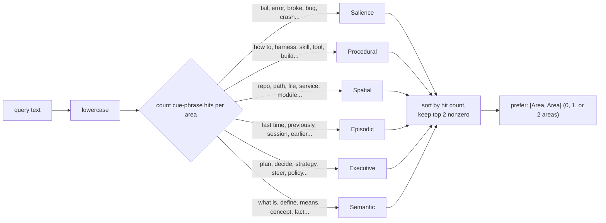

# The Memory Layer


> **On citations.** This document names files, not line numbers. The repo is
> under active development and spans go stale within hours — an earlier draft
> of these docs cited `tui/src/agent_main.rs` lines that had already moved by
> the time it was written. For an exact span, ask the code:
> `graft ask "<question>" --source`, or `graft skeleton <file>`.

The memory layer (`memory-layer/`, a Rust crate) is Mnemo's distinctive
piece: a small graph database modeled loosely on how a brain organizes
different kinds of memory, mutated only through an append-only journal, and
consulted automatically before the model ever sees a prompt (see
`docs/DATAFLOW.md`, step 3). This document covers the graph model, the six
brain areas and how queries get routed to them, the journal and its
replay semantics, the steering and consolidation algorithms that reshape
memory over time, and `memsrv`, the JSON-RPC surface every other process
talks to.

## Graph model

Three kinds of thing exist, all defined in `memory-layer/src/model.rs`:

- **`Node`** (`memory-layer/src/model.rs`) — has a `NodeKind`
  (`Aspect`, `TaskEpisode`, `Entity`, `Harness`, `Outcome`;
  `memory-layer/src/model.rs`), an `Area`, a `label`, a list of
  `Fact`s, an append-only `log` of `LogEntry`, and a `context: Vec<ContextChunk>`
  field that is explicitly **derived** — never itself journaled, always
  recomputed (`memory-layer/src/model.rs`).
- **`Fact`** (`memory-layer/src/model.rs`) — a key/value pair on a
  node with `Active`/`Superseded` status; superseding a fact does not
  delete it, it flips `status` and records `superseded_by`, so a node's
  history of what it used to believe is preserved.
- **`Edge`** (`memory-layer/src/model.rs`) — typed, weighted,
  directional, with a `success`/`failure` counter and `valid_from`/
  `invalid_at` (soft-delete via `Unlink`, not removal). `EdgeKind`
  (`memory-layer/src/model.rs`): `SuppliesContext` (the "this node
  owes that node context" push contract), `PartOf` (cluster membership),
  `DerivedFrom` (episode/outcome cites the aspects it used), `Supersedes`
  (temporal replacement), `ActivatedWith` (Hebbian co-retrieval
  association).

`Node::active_facts()` filters to `FactStatus::Active` only
(`memory-layer/src/model.rs`); `Edge::alive_at(t)` is true when the
edge has not been invalidated, has started, and has positive weight
(`memory-layer/src/model.rs`) — the three checks anything reading
the graph as of "now" needs.

## Brain areas

`Area` (`memory-layer/src/model.rs`) is six variants, each mapped in
the source comments to a real brain structure:

| Area | Brain analogue | Holds |
|---|---|---|
| `Episodic` | hippocampus | episodes, outcomes |
| `Semantic` (default) | neocortex | aspect facts |
| `Procedural` | cerebellum | harnesses, skills |
| `Spatial` | parietal | repos, paths, services |
| `Salience` | amygdala | failure/pain markers |
| `Executive` | prefrontal | steering decisions, plans |

A node's area defaults from its kind via `Area::for_kind`
(`memory-layer/src/model.rs`: episodes/outcomes → Episodic, aspects →
Semantic, harnesses → Procedural, entities → Spatial) but can be
overridden — either at creation (`create_node`/`episode`'s optional `area`
param, `memory-layer/src/bin/memsrv.rs`) or later via `Op::SetArea`
(`memory-layer/src/bin/memsrv.rs`). This is why `Salience` and
`Executive` nodes exist at all despite having no dedicated `NodeKind` — a
pain marker created during steering (below) is an `Aspect` node whose area
is explicitly set to `Salience` right after creation
(`memory-layer/src/steering.rs`).

## Query routing and the cross-area discount

`route_query` (`memory-layer/src/search.rs`) is a keyword heuristic,
described in its own comment as "deliberately dumb — the point is to bias
retrieval, not to classify correctly every time"
(`memory-layer/src/search.rs`). It scores each area by how many of
its cue phrases appear in the lowercased query, keeps the top two
non-zero-scoring areas, and returns an empty list ("search everywhere") if
nothing matched:



Routing does **not** filter the search — it *biases* it. `SearchOpts`
(`memory-layer/src/search.rs`) separates `areas` (a hard filter,
empty = every area) from `prefer` (the routed areas, used only to weight
scores). Every node outside the preferred areas is still searched and can
still win, just discounted by `CROSS_AREA_DISCOUNT = 0.85`
(`memory-layer/src/search.rs`) — 85% of its raw cosine score. The comment
explains the tuning intent directly: "low enough to reorder near-ties, high
enough that a mis-routed query still finds the right node — the router is a
keyword heuristic, it WILL be wrong"
(`memory-layer/src/search.rs`). `memsrv`'s `search` handler applies
this by default — explicit `areas` in the request are a hard filter, and
absent that, the router's picks become `prefer`
(`memory-layer/src/bin/memsrv.rs`):

```rust
let asked = parse_areas(params)?;
let routed = if asked.is_empty() { route_query(query) } else { asked.clone() };
let opts = SearchOpts::areas(asked).prefer(routed.clone());
```

After scoring, `expand()` (`memory-layer/src/search.rs`) does one hop
of graph-aware rerank: each seed hit's live `PartOf`/`SuppliesContext`/
`ActivatedWith`/`DerivedFrom` neighbors get a candidate score of
`seed_score * 0.5 * edge_weight` (floored at `edge_weight.max(0.1)` so a
freshly-created, unweighted edge still contributes something), and a
neighbor's final score is the max across however many seeds reached it.
Crucially, a neighbor that fails the area/kind filter is dropped even
though it was reached via a passing node — "a filtered-out node must not
sneak back in as a neighbour" (`memory-layer/src/search.rs`).

## The journal: op → replay → node/edge state

Every mutation is one of the ten `Op` variants
(`memory-layer/src/model.rs`): `CreateNode`, `AddFact`,
`SupersedeFact`, `SetArea`, `DeleteNode`, `Link`, `Unlink`, `Reweight`,
`RecordOutcome`, `PushContext`, `CommitLog`. `StoreData::apply(&op)`
(`memory-layer/src/store.rs`) is the single place any of these take
effect; every RPC handler in `memsrv.rs` composes a small `apply` closure
that does both halves atomically in sequence — `s.apply(&op)` against the
in-memory store, then `j.append(&op)` to the on-disk journal
(`memory-layer/src/bin/memsrv.rs`). "Replay(ops) == current state"
is stated as an invariant directly on the `Op` enum
(`memory-layer/src/model.rs`), and `persist::replay`
(`memory-layer/src/persist.rs`) is the literal fold that reconstructs
a `StoreData` from nothing but the ops list — this is what every `memsrv`
does on startup (`memory-layer/src/bin/memsrv.rs`), and what makes the
journal file, not any in-memory structure, the actual source of truth.

```mermaid
stateDiagram-v2
    [*] --> Journal: Op appended (JSONL line)
    Journal --> Replay: on memsrv startup,<br/>Journal::read_all() + fold
    Replay --> StoreData: StoreData.apply(op) per line,<br/>in file order

    state StoreData {
        [*] --> NodeExists: CreateNode
        NodeExists --> NodeExists: AddFact / SupersedeFact<br/>(old fact -> Superseded,<br/>new fact -> Active)
        NodeExists --> NodeExists: SetArea (area reassigned,<br/>logged)
        NodeExists --> NodeDeleted: DeleteNode(hard=false)<br/>(deleted=true, kept)
        NodeExists --> [*]: DeleteNode(hard=true)<br/>(removed from map)

        [*] --> EdgeExists: Link (weight=0.5 default)
        EdgeExists --> EdgeExists: Reweight / RecordOutcome<br/>(weight clamped 0..1)
        EdgeExists --> EdgeInvalid: Unlink (invalid_at set,<br/>soft — row kept)
    }

    StoreData --> DerivedState: state_of(node) computed on read<br/>(active facts + recent log + context chunks)
```

Two mutation shapes are worth calling out because they encode a design
choice rather than a mechanical fact:

- **`DeleteNode` is soft by default.** `hard: bool` controls whether the
  node is actually removed from the map or just flagged `deleted: true` and
  left in place with a log entry recording it
  (`memory-layer/src/store.rs`). A soft-deleted node is invisible to
  search (`passes_filter` excludes `deleted`,
  `memory-layer/src/search.rs`) but its history is not destroyed.
- **`SupersedeFact` never overwrites.** The old `Fact` row is mutated only
  to flip its status and point at the new fact's id; the new value is a
  *new* `Fact` appended to the same node
  (`memory-layer/src/store.rs`). `state_of()`
  (`memory-layer/src/store.rs`) only shows active facts, so this is
  invisible on a normal read — but the superseded row is still there for
  anyone reconstructing what the node used to say.

The journal file itself is append-only, and every writer — `memsrv`,
`memcli`, or a second `memsrv` process reading/writing the same file (the
TUI's own instance, or a sub-agent's) — takes an advisory `fd_lock` on a
sibling `.lock` file before appending
(`memory-layer/src/persist.rs`), so concurrent processes never
interleave partial JSON lines even though there is no single owning writer
process.

## Steering: turning a failure into structural change

`steer()` (`memory-layer/src/steering.rs`) is what
`memory_steer` and the RPC `steer` method call. It is a *pure planner* —
given the store, it returns a `Vec<Op>` and a `SteerNotes` summary; nothing
is applied until the caller (`memsrv`'s `handle()`) walks the returned ops
through `apply` (`memory-layer/src/bin/memsrv.rs`). Five things
happen, unconditionally in order and then conditionally:

1. **Log it.** A `CommitLog` entry on the episode, always
   (`memory-layer/src/steering.rs`).
2. **Pain marker, unconditionally, before any decision.** A new `Aspect`
   node, area forced to `Salience`, with a `failure` fact, linked from the
   episode via `DerivedFrom` — specifically *not* `SuppliesContext`, so a
   pain marker can never later become a blame target for the *next* failure
   (`memory-layer/src/steering.rs`). The comment frames this as
   "amygdala logic: capture that it hurt, cheaply and unconditionally;
   deciding what to do about it is the rest of this function"
   (`memory-layer/src/steering.rs`).
3. **Attribute blame.** Every live `SuppliesContext` feeder of the episode
   (`store.feeders_of`, sorted by weight,
   `memory-layer/src/store.rs`) is checked for lexical token
   overlap between the failure text and the feeder node's facts/label
   (`memory-layer/src/steering.rs`). An overlapping or
   explicitly-corrected feeder gets `RecordOutcome{success: false}`, which
   drops its edge weight by 0.10 (clamped at 0;
   `memory-layer/src/store.rs`).
4. **Apply the correction**, if the caller supplied one (`fix: {node, fact,
   new_key, new_value}`) — this is a `SupersedeFact` on the named node,
   validated against the store first (the target fact must exist and be
   currently active; `memory-layer/src/steering.rs`).
5. **Switch feeders that fell below threshold.** For every implicated edge,
   `projected_weight` (current weight + the -0.10 penalty, clamped) is
   compared against `SWITCH_THRESHOLD = 0.2`
   (`memory-layer/src/steering.rs,130-140`); if it falls below and
   another live feeder above threshold exists, the old edge is `Unlink`ed
   and a new `SuppliesContext` edge is `Link`ed from the alternate source.
6. **If nothing at all was implicated and there was no correction**, a
   fresh "gap" `Aspect` node is created recording that the agent lacked
   relevant knowledge, wired as a new feeder of the episode
   (`memory-layer/src/steering.rs`) — so a failure with no
   identifiable cause still leaves a trace that can be filled in later
   rather than vanishing.

The success path, `reinforce()` (`memory-layer/src/steering.rs`),
is the mirror image and much simpler: log the outcome, then
`RecordOutcome{success: true}` (+0.05 weight, clamped at 1.0) on every live
feeder of the episode — a Hebbian "what fired together" nudge with no
blame logic needed.

## Consolidation: the sleep cycle

`consolidate()` (`memory-layer/src/consolidate.rs`) is explicitly
described as "the sleep cycle of research/brain-areas-design.md"
(`memory-layer/src/consolidate.rs`) — it replays `Episodic` and
`Salience` nodes looking for recurring themes and distills them into
`Semantic` "lesson" nodes. Also a pure planner, and explicitly **idempotent**:
"running it twice in a row emits nothing the second time"
(`memory-layer/src/consolidate.rs`). The algorithm:

1. Tokenize every non-deleted `Episodic`/`Salience` node's label + active
   fact values, dropping stopwords (`memory-layer/src/consolidate.rs,21-26`).
2. A token becomes a "recurring" theme once it appears in at least
   `MIN_OCCURRENCES = 2` distinct source nodes
   (`memory-layer/src/consolidate.rs,65-73`).
3. Group nodes by shared recurring tokens; a group only survives if its
   members share at least `MIN_SHARED_TOKENS = 2` tokens in common — "two
   sources that share only 'checkout' are the same project, not the same
   lesson" (`memory-layer/src/consolidate.rs,75-96`). Groups with the
   same signature collapse into one lesson.
4. For each surviving group: if a `Semantic` node with that exact `lesson:
   <tokens>` label already exists and its `sources` fact already matches,
   emit nothing (the idempotent case). If the sources changed, `SupersedeFact`
   the `sources` fact with the new evidence set. Otherwise, create a fresh
   `Semantic`-area `Aspect` node with `recurring_theme` and `sources` facts
   (`memory-layer/src/consolidate.rs`).

`mnemo consolidate` (`agent/bin/mnemo.ts`) is a pure memory-layer
operation with no model call involved at all — it runs entirely inside
`memsrv`'s `consolidate` handler
(`memory-layer/src/bin/memsrv.rs`).

## Auto-recall

Covered in depth in `docs/DATAFLOW.md` (step 3): `recallFor`
(`agent/extensions/memory-layer.ts`) runs a memsrv `search` before
every model call whose prompt looks substantive, keeps only hits within a
relative 60% of the best score (`selectRecall`,
`agent/extensions/memory-layer.ts`), and injects them into the
system prompt framed explicitly as retrieval candidates rather than
established fact. This is the mechanism that makes memory *automatic*
rather than something the model has to remember to ask for.

## `memsrv`: the integration surface

`memory-layer/src/bin/memsrv.rs` is the only thing any other process talks
to. Its `main()` (`memory-layer/src/bin/memsrv.rs`) replays the
journal on startup, opens an embedder (OpenRouter if
`OPENROUTER_API_KEY` is set and not deliberately stripped, else a
deterministic local `HashingEmbedder` —
`memory-layer/src/bin/memsrv.rs`; the agent-side `MemClient`
explicitly strips `OPENROUTER_API_KEY` from the child's env unless
`SEA_MEMORY_REMOTE=1`, `agent/extensions/memory-layer.ts`, so remote
embeddings are opt-in), and then loops reading one JSON-RPC request per
line until `exit`/`quit`. Its logical clock is monotonic and independent of
wall time — every request bumps `clock` by 1 before use
(`memory-layer/src/bin/memsrv.rs`), which keeps `Millis` timestamps
strictly ordered even under rapid-fire requests. The thirteen supported
methods (`memory-layer/src/bin/memsrv.rs`):

| Method | Purpose |
|---|---|
| `ping` | Liveness check. |
| `dump` | List every live node with id/kind/area/label/fact-count/feeder-count. |
| `state` | `state_of(node)` — one node's derived text snapshot. |
| `create_node` | New `Aspect`/`Entity`/`Harness`/`Outcome` node, optional `area` override. |
| `episode` | New `TaskEpisode` node — what a session logs against. |
| `fact` | Add a fact to a node. |
| `link` | New `SuppliesContext` edge. |
| `search` | Route + embed + cosine + graph-expand; see above. |
| `steer` | Failure steering; see above. |
| `good` | Success reinforcement (`reinforce`). |
| `consolidate` | Distill recurring episodes into lessons. |
| `commit_log` | Append a log entry to a node (used by the `tool_execution_end` hook). |
| `set_area` | Reassign a node's brain area. |

## Clients

- `agent/extensions/memory-layer.ts`'s `MemClient` — the agent's own
  connection, FIFO-queued (`agent/extensions/memory-layer.ts`), lazily
  spawned on first request (`agent/extensions/memory-layer.ts`).
  Exposes `memory_search`, `memory_write_fact`, `memory_steer` as pi tools
  (`agent/extensions/memory-layer.ts`).
- `tui/src/memclient.rs`'s `MemSession`/`query()` — the TUI's independent
  connection for the Memory pane, spawning its own `memsrv` process against
  the same default journal path (`tui/src/memclient.rs`).
- `memory-layer/src/bin/memcli.rs`, `memeval.rs`, `mempolicy.rs` — scripting
  and evaluation CLIs that operate on a journal file directly, no live
  agent required.

## Open threads

- Search is brute-force cosine over every live node's embedding
  (`memory-layer/src/search.rs`, `search()`), explicitly marked
  "fine to ~100k nodes"; an ANN path exists (`search_ann`,
  `memory-layer/src/search.rs`, backed by `memory-layer/src/ann.rs`)
  but `memsrv.rs`'s `search` handler currently calls the brute-force
  `search`, not `search_ann` — the ANN path is present in the crate but not
  wired into the sidecar's default query path.
- `route_query`'s cue-word lists are hand-written and English-only; a query
  in another language or one that does not happen to use these exact
  phrases routes to no preferred area (empty `prefer`), which degrades
  gracefully (search runs unbiased) rather than failing, but also means the
  cross-area discount never helps such a query.
