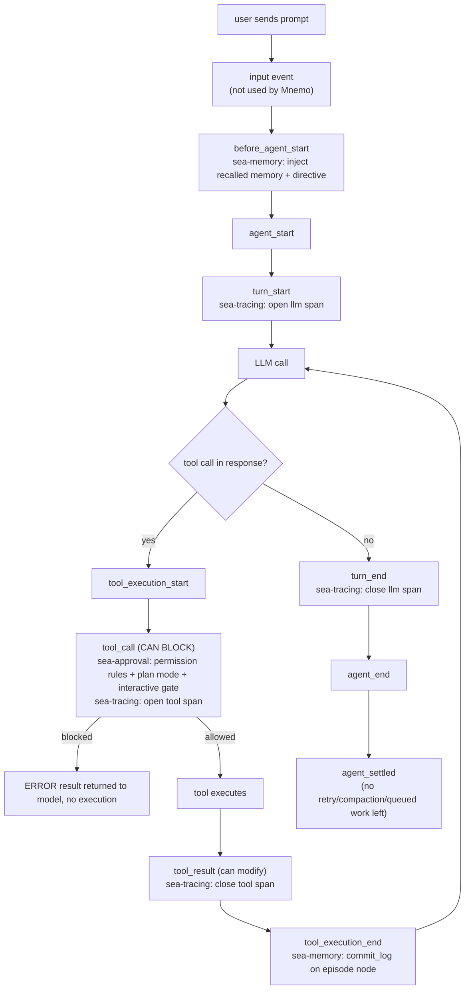

# Wrapping `pi`

> **On citations.** This document names files, not line numbers. The repo is
> under active development and spans go stale within hours — an earlier draft
> of these docs cited `tui/src/agent_main.rs` lines that had already moved by
> the time it was written. For an exact span, ask the code:
> `graft ask "<question>" --source`, or `graft skeleton <file>`.

Mnemo does not implement its own agent loop, tool-call protocol, session
persistence, streaming, model provider abstraction, or terminal-mode/RPC-
mode/print-mode dispatch. All of that comes from `@earendil-works/pi-coding-agent`
(pinned to `^0.84.3` in `agent/package.json`), an external npm dependency
vendored under `agent/node_modules/@earendil-works/`. Mnemo is, structurally,
a CLI shim (`agent/bin/mnemo.ts`) plus four `InlineExtension`s that hook into
pi's own extension system. This document covers what pi provides, exactly
how Mnemo plugs into it, and what pi's RPC protocol and extension lifecycle
look like from the outside.

## The shim: `agent/bin/mnemo.ts`

`run()` (`agent/bin/mnemo.ts`) does, in order:

1. **Node version check** — fails fast with a readable message rather than
   a `SyntaxError` from the next import, on a pre-22.18 Node
   (`agent/bin/mnemo.ts`).
2. **Local subcommands that need no provider**: `--list-sessions`, `auth
   status|logout`, `traces`, `consolidate` are all handled directly and
   `return` before pi is ever touched (`agent/bin/mnemo.ts`) — they
   read local files or talk to memsrv, nothing else.
3. **Pi's own subcommands / flags** (`install`, `remove`, `update`, `list`,
   `config`, `--help`, `--version`) are forwarded to `main()` immediately,
   also without a provider check (`agent/bin/mnemo.ts`).
4. **Everything else** goes through `ensureAuthenticated()`
   (`agent/bin/mnemo.ts`) — resolve a provider from env/flags, or
   the stored default in `~/.mnemo/auth.json`, or (interactive + TTY only)
   run the first-run auth wizard — then appends `--provider`/`--model`/
   `--no-builtin-tools` to `argv` if the user did not already specify them,
   and calls pi's `main(args, { extensionFactories: factories() })`
   (`agent/bin/mnemo.ts`).

`--no-builtin-tools` is significant: it tells pi not to register its own
built-in `bash`/`read`/`write`/`edit` tools, so the only tools available in
a session are the ones Mnemo's `sea-tools-inline` extension registers
(`agent/bin/mnemo.ts,310`). This is why Mnemo has its *own*
`bash_exec`/`read_file`/`write_file`/`apply_edit` rather than reusing pi's —
they carry Mnemo's permission-rule and approval-gate integration that pi's
built-ins do not know about.

## What pi provides for free

From `main()` onward, pi owns:

- **Mode dispatch** — interactive TUI (when pi itself is run standalone),
  `--mode rpc` (JSONL commands/events over stdio — what `tui/src/rpc.rs`
  drives), `--mode json`, and print mode (one-shot prompt, non-TTY —
  what `spawn_subagent`'s children run in).
- **The agent loop itself** — turns, streaming, tool-call resolution,
  parallel tool execution within one assistant message, retries, auto-
  compaction.
- **Session persistence** — append-only session files under
  `~/.pi/agent/sessions/<encoded-cwd>/<timestamp>_<uuid>.jsonl`, keyed by
  the working directory the agent ran in, with fork/clone/tree navigation
  and resume built in. Mnemo never writes to this store directly; the TUI
  reads it (`tui/src/sessions.rs`) to populate the Sessions pane, but pi
  itself owns writes.
- **Model/provider registry** and `--list-models`.
- **The extension system** — `pi.on(event, handler)`,
  `pi.registerTool()`, `pi.registerCommand()`, and the `ctx.ui` surface for
  extension-initiated user interaction (`confirm`, `select`, `input`,
  `notify`, etc.), which in RPC mode is translated into a request/response
  sub-protocol (`extension_ui_request`/`extension_ui_response`) rather than
  drawn to a real terminal.

## Mnemo's four extensions

Registered as `InlineExtension`s in `factories()`
(`agent/bin/mnemo.ts`) — the "inline" form means they ship as part
of the `mnemo` binary rather than being discovered from
`~/.pi/agent/extensions/`, so every mode (interactive, RPC, print, JSON)
gets them identically with no per-user install step.

### `sea-tools` (`agent/extensions/sea-tools-inline.ts`)

`seaToolsFactory(pi)` (`agent/extensions/sea-tools-inline.ts`) does
two things:

1. Registers every Mnemo tool — `allTools` (11 core tools,
   `agent/src/tools/index.ts`) plus `makeMemoryTools()` (3 memory
   tools) plus any discovered MCP tools — onto `pi.registerTool()`, wrapped
   through `toToolDefinition` to adapt Mnemo's `SeaTool.execute(toolCallId,
   params, signal)` shape into pi's `ToolDefinition.execute`
   (`agent/extensions/sea-tools-inline.ts`).
2. Wires `sharedKernel.setToolDispatcher(...)` so the same tools are
   callable from inside `ipy_run` as `tools.<name>(...)`, gated through the
   identical `decideApproval` path a normal tool call goes through
   (`agent/extensions/sea-tools-inline.ts`; see `docs/KERNEL.md`).

### `sea-memory` (hooks half of `agent/extensions/memory-layer.ts`)

Registered as `{ name: "sea-memory", factory: memoryLayerHooks }`
(`agent/bin/mnemo.ts`) — hooks only, because the memory *tools*
(`memory_search`, `memory_write_fact`, `memory_steer`) are already
registered by `sea-tools-inline`, and pi rejects two extensions registering
a tool of the same name (`agent/extensions/sea-tools-inline.ts`).
`registerLifecycle` (`agent/extensions/memory-layer.ts`) attaches
four hooks:

| pi event | What it does |
|---|---|
| `session_start` | `ensureEpisode` — create (once) the `TaskEpisode` node this session logs against. |
| `before_agent_start` | Append `MEMORY_DIRECTIVE` and the auto-recalled block to the system prompt (see `docs/DATAFLOW.md`). |
| `tool_execution_end` | Append one `commit_log` entry — `"{toolName}: ok\|error"` — to the episode node. |
| `session_shutdown` | Log a final `"outcome": "session ended"` entry, then `client.stop()`. |

### `sea-approval` (`agent/extensions/approval-gate.ts`)

`approvalExtensionFactory` (`agent/extensions/approval-gate.ts`)
loads `~/.mnemo/permissions.json` once at session start (deliberately not
re-read mid-session — "a mid-session edit should not change the rules
under a run that is already executing",
`agent/extensions/approval-gate.ts`), sets plan mode from
`MNEMO_PLAN_MODE`, and subscribes to pi's `tool_call` hook — the one hook in
pi's lifecycle that **can block** a call before it executes
(`agent/extensions/approval-gate.ts`). It also flips
`src/approval.ts` into "delegated" mode so a legacy in-tool readline gate
(kept for callers of the tools outside pi) does not double-prompt on the
same TTY (`agent/extensions/approval-gate.ts,102`).

### `sea-tracing` (`agent/extensions/tracing.ts`)

`tracingFactory` (`agent/extensions/tracing.ts`) constructs one
`Tracer` per process and calls `attachTracing`, which opens the root
session span and subscribes to `tool_call`/`tool_result` and
`turn_start`/`turn_end` to open/close nested spans
(`agent/extensions/tracing.ts`). See `docs/DATAFLOW.md` for the full
span lifecycle and `docs/ARCHITECTURE.md` for why this is the fourth
line-delimited-JSON boundary in spirit even though spans are only ever
*written*, never a request/response protocol.

## pi's extension lifecycle, as Mnemo uses it

pi's own lifecycle diagram (from
`agent/node_modules/@earendil-works/pi-coding-agent/docs/extensions.md`)
covers far more than Mnemo hooks into; the events Mnemo actually subscribes
to are `session_start`, `before_agent_start`, `tool_call`, `tool_result`,
`tool_execution_end`, `turn_start`, `turn_end`, and `session_shutdown`. In
order, for one prompt:

`tool_call` is the only hook in this chain that can outright refuse to run
something; `tool_result` can only reshape what already ran. That asymmetry
is why the permission engine lives entirely on `tool_call`
(`agent/extensions/approval-gate.ts`) — there is no later point where a
denied action could be un-executed.

## RPC mode, from the TUI's point of view

`tui/src/rpc.rs` is a from-scratch client for pi's `--mode rpc` protocol —
it does not use any of pi's own client code, because pi is a Node package
and the TUI is Rust. The protocol itself (commands in on stdin, events out
on stdout, one JSON object per line, `\n`-only framing) is documented
exhaustively in pi's own `docs/rpc.md`; Mnemo's `parse_event`
(`tui/src/rpc.rs`) intentionally narrows that down to only the seven
event shapes the Chat pane needs (`agent_start`, `agent_settled`, failed
`response`s, `message_update` text/thinking deltas, authoritative
`message_end`, `turn_end` usage stats, and `tool_execution_start`/`_end`) —
"unknown event types are ignored on purpose: pi adds events between
versions and an unknown one is not an error"
(`tui/src/rpc.rs`). This is a narrow, deliberately incomplete client:
it does not implement `get_state`, session compaction commands, model
switching over RPC, or the `extension_ui_request`/`_response` sub-protocol
(dialog-style extension prompts degrade to auto-allow inside the kernel
dispatcher, per `docs/KERNEL.md`, and the interactive approval gate uses
its own TTY-attached prompt rather than this sub-protocol).

## What this buys, and what it costs

Buys: an agent loop, streaming, session persistence, provider abstraction,
and a stable extension API that Mnemo does not have to build or maintain —
building all of that is explicitly out of scope for this project, whose
distinctive contribution is the memory layer, not the agent loop.

Costs: Mnemo is coupled to pi's extension contract and pinned version
(`^0.84.3`); a breaking change in pi's hook signatures, RPC event shapes, or
`InlineExtension` mechanism is a breaking change for Mnemo. The pin is a
caret range, so a pi patch/minor release can land without Mnemo explicitly
opting in — a hazard visible in the tests: `tui/src/rpc.rs`'s
`turn_end_carries_the_cost_of_the_round_trip` test is explicitly commented
as "shape recorded from a live `mnemo --mode rpc` run"
(`tui/src/rpc.rs`), i.e. pinned against observed behavior rather
than a published schema.
